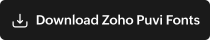

# Loom Design System

> A unified design system for Zoho products - built on DSG standards, implemented with Lyte components.

Loom weaves consistent UI patterns across any Zoho product that adopts it. It provides design tokens following Zoho DSG (Design Standard Groups) guidelines and component implementations using the [Lyte framework](https://lyteframework.com).

> **Architecture, personas, and the override model live in [architecture.md](architecture.md).** Read that first if you're new.

### Personas at a glance

| Persona | Repo | Can commit? |
|---|---|---|
| **Maker** | Sandbox (this repo) | ✅ Sandbox only |
| **Team Admin** | Their product repo | ✅ Product (manages roles) |
| **Designer** | Their product repo | ✅ Product (via catalogue UI) |
| **Developer** | Their product repo | ❌ Read-only (copy Lyte code) |

Sandbox is sealed - no one but Makers commits here, ever.

**Pages:**
- [Sandbox Catalogue](https://kamalakannan-raju-2916.github.io/loom-ds/sandbox.html) - base components, rules, WCAG checker (Makers + reference)
- [Designer Edit UI](https://kamalakannan-raju-2916.github.io/loom-ds/designer.html) - token + component editors with live preview & WCAG (Designers)
- [Product Catalogue](https://kamalakannan-raju-2916.github.io/loom-ds/catalog.html) - Writer (Designers + Devs)

<p align="center">
  <a href="https://kamalakannan-raju-2916.github.io/loom-ds/catalog.html" target="_blank" rel="noopener noreferrer">
    
  </a>
</p>

---

## Fonts - Zoho Puvi (proprietary)

Loom standardises on **Zoho Puvi** for all UI and design tooling. Always use this family unless explicitly instructed otherwise.

| Family | Use |
|---|---|
| Zoho Puvi | Primary sans - UI text, headings, body |
| Zoho Puvi Compact | Tight UI labels, badges |
| Zoho Puvi Condensed | Narrow column headings |
| Zoho Puvi Mono | Code, hex codes, design-tool labels (Family Name / Position in the Figma plugin) |
| Zoho Puvi Serif | Editorial, long-form documents |
| Zoho Puvi Slab | Display, marketing |
| Zoho Puvi Tamil | Tamil script support |

<p align="center">
  <a href="https://github.com/kamalakannan-raju-2916/loom-ds/raw/main/assets/fonts/zoho-puvi.zip" download>
    
  </a>
</p>

Unzip and install all `.otf` files locally, then restart Figma.

To rebuild the bundle after adding/updating OTFs:

```bash
./scripts/zip-fonts.sh
```

See [assets/fonts/zoho-puvi/README.md](assets/fonts/zoho-puvi/README.md) for the full file manifest.

---

## How It Works

```
┌─────────────────────────────────────────────────────────┐
│  DSG (Zoho Design Standard Groups)                      │
│  Global standards: colors, typography, spacing, icons   │
└────────────────────────┬────────────────────────────────┘
                         ▼
┌─────────────────────────────────────────────────────────┐
│  Loom Design Tokens                                     │
│  Primitive → Semantic → Component tokens                │
│  Light & Dark themes, WCAG AA compliant                 │
└────────────────────────┬────────────────────────────────┘
                         ▼
┌─────────────────────────────────────────────────────────┐
│  Lyte Components                                        │
│  HTML/CSS implementation using Lyte framework (v3.9)    │
│  lyte-component, templates, data binding, routing       │
└────────────────────────┬────────────────────────────────┘
                         ▼
┌─────────────────────────────────────────────────────────┐
│  Zoho Products                                          │
│  Any product that adopts Loom gets themed components    │
└─────────────────────────────────────────────────────────┘
```

---

## Token Architecture

Tokens flow through three tiers - every design decision traces back to DSG primitives.

| Tier | Source | Purpose | Example |
|---|---|---|---|
| **Primitive** | DSG | Raw values (no meaning) | `cornflower.base` → `#2D78FF` |
| **Semantic** | Loom | UI roles (themed) | `surface.primary`, `text.secondary` |
| **Component** | Loom | Scoped to component | `button.primary.bg`, `input.border` |

---

## Spinning up a new product

Each product lives in its own repo (`loom-ds-<slug>`) consuming `@loom/sandbox`. Scaffold one with:

```bash
node scripts/new-product.js \
  --slug=writer \
  --product="Zoho Writer" \
  --admin=<github-user> \
  [--out=../loom-ds-writer]
```

The scaffolder copies [templates/product/](templates/product/), substitutes placeholders, then runs the resolver against the fresh tree to confirm it validates. Next step is `git init && push` to its own repo.

See [scripts/new-product.js](scripts/new-product.js) and [templates/product/README.md](templates/product/README.md).

---

## Themes

| Theme | Surface | Text | Purpose |
|---|---|---|---|
| **Light** | White base | Dark text | Default |
| **Dark** | Near-black base | Light text | Low-light / night mode |

Themes are applied via a `data-theme` attribute:

```html
<html data-theme="light">
```

---

## Tech Stack

| Layer | Technology |
|---|---|
| Design tokens | JSON (DTCG format), CSS custom properties |
| CSS build | `node scripts/build-css.js` - generates `css/loom-*.css` from token JSON |
| Component framework | [Lyte](https://lyteframework.com) v3.9 |
| UI components | `@zoho/lyte-ui-component` (buttons, dropdowns, modals, tables, etc.) |
| Styling | CSS with `--loom-*` custom properties |
| Figma plugin | `figma-plugin/` - reads tokens from GitHub, creates Figma variables |
| Figma sync (advanced) | Desktop Bridge + AI skills for maintainers |

---

## Quick Start

### Build CSS from tokens

```bash
node scripts/build-css.js
```

This generates three files in `css/`:

| File | Contents |
|---|---|
| `loom-primitives.css` | 713 custom properties - colors, typography, spacing, radii, shadows |
| `loom-semantic.css` | Light/Dark theme tokens + component tokens |
| `loom-tokens.css` | Combined entry point (imports both above) |

### Using Loom tokens in a Lyte component

```css
/* component.css */
.panel {
  background: var(--loom-surface-primary);
  color: var(--loom-text-primary);
  border: 1px solid var(--loom-border-default);
  border-radius: var(--loom-radius-lg);
  padding: var(--loom-space-6);
}
```

```html
<!-- component.html (Lyte template) -->
<template tag-name="loom-panel">
  <div class="panel">
    <lyte-yield yield-name="content"></lyte-yield>
  </div>
</template>
```

### For designers (Figma Plugin)

Loom ships a **Figma plugin** that reads tokens directly from the GitHub repo - no Desktop Bridge needed.

<p align="center">
  <a href="https://github.com/kamalakannan-raju-2916/loom-ds/raw/main/assets/figma-plugin/loom-figma-plugin.zip" download>
    
  </a>
</p>

#### Install & use
1. Download and unzip **loom-figma-plugin.zip** (button above), or clone this repo
2. In Figma, go to **Plugins → Development → Import plugin from manifest…**
3. Select `manifest.json` from the unzipped folder (or `figma-plugin/manifest.json` from the repo)
4. Run the plugin: **Plugins → Loom Design Tokens**
5. Choose a product (e.g. Zoho Writer)
6. Click **Sync to Figma** - the plugin creates a `Loom / <Product> / Primitives` variable collection with all color, typography, spacing, and radii tokens

The plugin fetches live from `main` branch, so tokens are always current.

> **Maintainers:** after editing anything under `figma-plugin/`, rebuild the bundle so the download button serves the latest version:
>
> ```bash
> ./scripts/zip-figma-plugin.sh
> ```

#### Advanced: Desktop Bridge + AI skills

Maintainers can also use the **Figma Desktop Bridge** and AI skills for more advanced workflows:

- **DSG color palettes** → See [`.github/skills/dsg-color-tokens-generator/SKILL.md`](.github/skills/dsg-color-tokens-generator/SKILL.md)
- **Semantic token sync** → See [`.github/skills/semantic-token-sync/SKILL.md`](.github/skills/semantic-token-sync/SKILL.md)
- **Component export** → See [`.github/skills/figma-component-export/SKILL.md`](.github/skills/figma-component-export/SKILL.md)

---

## Repository Structure

```
loom-ds/
├── .github/
│   └── skills/
│       ├── dsg-color-tokens-generator/
│       │   └── SKILL.md                 ← DSG color palettes → Figma
│       ├── semantic-token-sync/
│       │   └── SKILL.md                 ← Semantic tokens → Figma
│       └── figma-component-export/
│           └── SKILL.md                 ← Figma components → Repo
├── tokens/
│   ├── primitive/
│   │   ├── colors.json              ← DSG primitive colors (616 tokens, 28 families)
│   │   ├── typography.json          ← Font families, weights, sizes, line-heights, type scale
│   │   ├── spacing.json             ← 4px-base spacing, icon sizes, stroke widths
│   │   └── radii.json               ← Border radii and shadow elevations
│   ├── products.json                ← Product registry (accent colors, included families)
│   ├── semantic/
│   │   └── colors.json              ← Semantic tokens (Light/Dark)
│   ├── components/
│   │   ├── button.json              ← Button component tokens
│   │   └── input.json               ← Input component tokens
│   └── products/
│       └── writer/
│           ├── config.json              ← Writer product config (accent, components)
│           └── components/              ← Figma-exported component specs
├── css/                                 ← Generated (do not edit)
│   ├── loom-primitives.css          ← Primitive custom properties
│   ├── loom-semantic.css            ← Semantic + component custom properties
│   └── loom-tokens.css              ← Combined entry point
├── scripts/
│   └── build-css.js                 ← Token JSON → CSS custom properties
├── figma-plugin/
│   ├── manifest.json                ← Plugin config (GitHub network access)
│   ├── code.js                      ← Figma sandbox (creates variables)
│   └── ui.html                      ← Product picker UI
├── docs/
│   ├── index.html                   ← Landing page (Designers Click Here)
│   ├── catalog.html                 ← Product catalog (color palettes)
│   └── project-knowledge.md         ← Full token spec and design rules
├── README.md
└── SETUP-GUIDE.md
```

---

## Workflow

```
┌───────────────────────────────────────────────────────────┐
│  1. Maintainer defines tokens in repo JSON             │
└─────────────────────────────┬─────────────────────────────┘
                              │  push (skill)
                              ▼
┌───────────────────────────────────────────────────────────┐
│  2. Figma receives variables (Primitives + Semantic)   │
└─────────────────────────────┬─────────────────────────────┘
                              │  designer builds
                              ▼
┌───────────────────────────────────────────────────────────┐
│  3. Designer creates components using those variables  │
└─────────────────────────────┬─────────────────────────────┘
                              │  export (skill)
                              ▼
┌───────────────────────────────────────────────────────────┐
│  4. Component specs pushed back to repo (per product)  │
└───────────────────────────────────────────────────────────┘
```

---

## Accessibility

Loom targets **WCAG AA** as mandatory, **AAA** wherever possible:

- Normal text contrast: ≥ 4.5:1 (AA) / 7:1 (AAA preferred)
- Large text contrast: ≥ 3:1 (AA) / 4.5:1 (AAA preferred)
- All interactive elements keyboard accessible
- Touch targets: minimum 44×44px
- Color never used as sole state indicator

---

## Contributing

1. Create an issue describing the proposed change
2. Branch from `main`, make your changes
3. Submit a PR - requires maintainer approval

**Rule:** Never override DSG primitives. If a value exists in DSG, Loom references it - it does not redefine it.

## License

Internal use only - Zoho Corporation.
